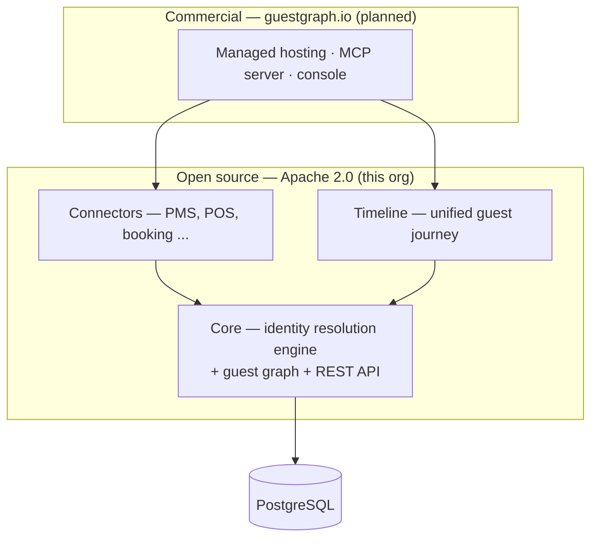

# GuestGraph

**The open-source guest identity graph.**

Guest data in hospitality is scattered — PMS, POS, booking engines, loyalty programs, wifi portals, review platforms — each with its own keys and its own version of the truth. GuestGraph ingests guest records from all of them and resolves which records belong to the same person, producing one unified, explainable guest profile: the guest graph.

## What it does

- **Ingest** raw guest records from any source system via a REST API — originals are stored immutably, never lost
- **Resolve** identities deterministically on strong identifiers (email, phone, loyalty ID, external keys), with transitive merging
- **Explain** every merge — ask *"why are these records one guest?"* and get the full decision chain
- **Unmerge** safely when resolution got it wrong — every merge is reversible
- **Query** unified golden profiles and their source records, per tenant

## How it fits together



## Status

🚧 **Early development.** The core identity resolution service is being built spec-first — see [`docs/`](docs/) and [`.specify/`](.specify/) for the design and specs.

## Stack

- Java 25 (virtual threads) · Spring Boot 4 · PostgreSQL
- Maven
- Spec-driven development with [spec-kit](https://github.com/github/spec-kit)

## Quickstart

Prerequisites: JDK 25 and Docker (Postgres runs via `compose.yaml` automatically).

```bash
./mvnw spring-boot:run -Dspring-boot.run.profiles=local   # seeds tenant "demo" + API key "demo-key"
```

```bash
# register a source system, ingest a record, resolve → guest id
curl -s -X POST localhost:8080/api/v1/source-systems \
  -H 'X-API-Key: demo-key' -H 'Content-Type: application/json' \
  -d '{"code":"opera-pms","name":"Opera PMS"}'
curl -s -X POST localhost:8080/api/v1/records \
  -H 'X-API-Key: demo-key' -H 'Content-Type: application/json' \
  -d '{"sourceSystem":"opera-pms","externalKey":"r-1","payload":{"firstName":"Anna","email":"anna@example.com"}}'
```

API surface (`/api/v1`, per-tenant `X-API-Key`, errors are RFC 9457 problem details):
`POST /source-systems` · `POST /records` · `GET /guests/{id}` · `GET /guests/{id}/records` ·
`GET /guests/{id}/explain` · `POST /guests/{id}/unmerge` · `GET /guests?identifier=…` ·
`GET /match-reviews` · `POST /match-reviews/{id}` — full contract in
[`specs/001-core-identity-resolution/contracts/openapi.yaml`](specs/001-core-identity-resolution/contracts/openapi.yaml),
walkthrough in [`specs/001-core-identity-resolution/quickstart.md`](specs/001-core-identity-resolution/quickstart.md).

## Developing

```bash
./mvnw verify              # build, tests, architecture rules, format check
./mvnw spotless:apply      # format (google-java-format, Google style) — CI rejects unformatted code
./scripts/regen-er.sh      # regenerate docs/er-schema.mmd after schema changes — CI checks drift
```

Note for Eclipse/Spring Tools users: point the IDE build output away from `target/classes`
(e.g. `bin/`), or stale IDE-compiled classes can break `./mvnw verify` with
`NoClassDefFoundError` until a `./mvnw clean`.

Until the first release, `V1__core_schema.sql` may still be edited in place; if your local
dev database reports a Flyway checksum mismatch, recreate it with `docker compose down -v`.
From the first tagged release on, migrations are additive-only.

## Design principles

1. **Source records are immutable** — the golden profile is derived, the original data is sacred
2. **Every merge is explainable and reversible** — identity resolution you can audit and trust
3. **Tenant-scoped from day one** — one instance serves many brands, properties, or customers
4. **API-first** — everything the engine can do is reachable over the REST API

## Roadmap

1. 🚧 **Core** — identity resolution engine (deterministic, probabilistic-ready), guest graph, REST API *(current)*
2. **Probabilistic matching** — fuzzy/ML resolution behind the same strategy interface, with review queue
3. **Timeline** — unified per-guest event timeline / journey
4. **Connectors** — ingest from real PMS/POS/booking systems

## License

[Apache 2.0](LICENSE) — GuestGraph's core is and will remain open source. Managed hosting and commercial services are planned at [guestgraph.io](https://guestgraph.io).
