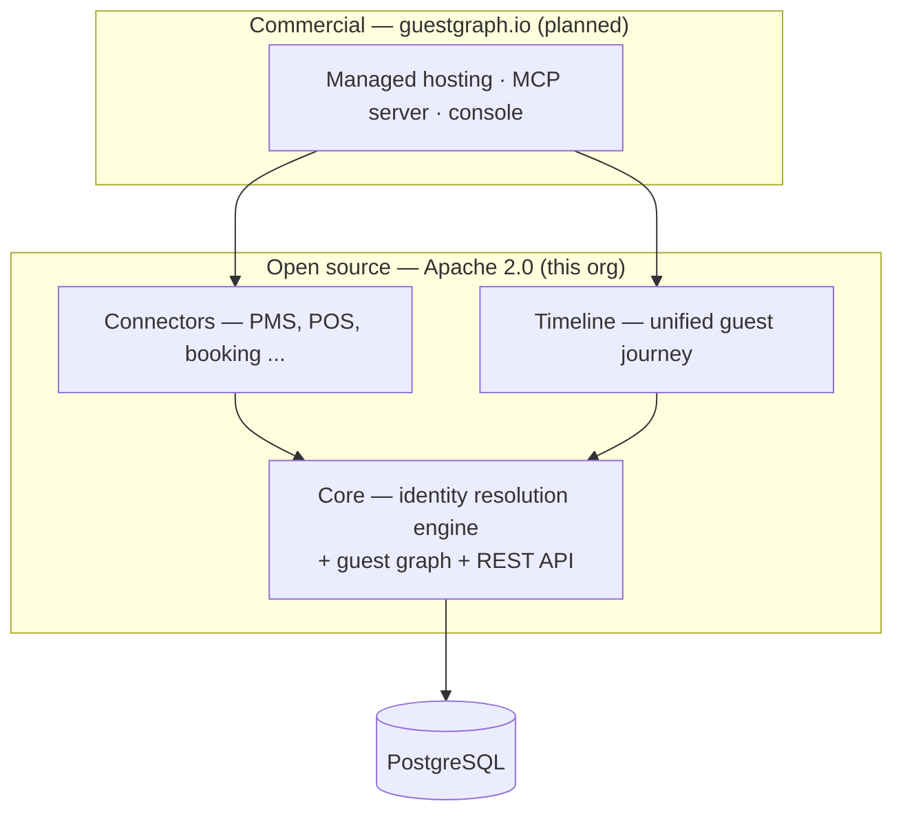

# GuestGraph — Engine

**The open-source guest identity graph.**

Guest data in hospitality is scattered — PMS, POS, booking engines, loyalty programs, wifi portals, review platforms — each with its own keys and its own version of the truth. GuestGraph ingests guest records from all of them and resolves which records belong to the same person, producing one unified, explainable guest profile: the guest graph.

## What it does

- **Ingest** raw guest records from any source system via a REST API — originals are stored immutably, never lost
- **Resolve** identities deterministically on strong identifiers (email, phone, loyalty ID, external keys), with transitive merging — and probabilistically on everything else, without ever merging silently
- **Explain** every merge — ask *"why are these records one guest?"* and get the full decision chain
- **Unmerge** safely when resolution got it wrong — every merge is reversible
- **Query** unified golden profiles and their source records, per tenant
- **Timeline** what a guest currently *has* — reservations and other source objects, resolved to the person who holds them now

## How matching decides

Identity resolution is a **layered confidence model**. Each layer decides only what it is
entitled to decide and hands the rest upward, and every layer's decisions are explainable and
reversible:

1. **Deterministic identifiers** — a shared email, phone, loyalty id, or ID document merges at full confidence
2. **Probabilistic scoring** — merges only above a threshold the tenant chose; otherwise it queues for a human
3. **A human steward** — the final word, and their splits stick: an unmerge writes a persistent do-not-merge rule that new evidence cannot silently cross

Probabilistic matching works in two stages, because they need different kinds of answer.
**Blocking** finds candidates that share no identifier at all — a database index can only answer
*equal*, so name phonetics collapse spelling variants onto one key. **Scoring** then grades each
candidate on a weighted feature vector — name, birthdate, phone, email, address — damped when
few signals were observed and heavily penalised when birthdates conflict, because different
birthdates are evidence of *different people* and that outweighs a strong name match.

**Automatic fuzzy merging ships off.** Out of the box no fuzzy score can reach the auto-merge
threshold, so probabilistic matching is a suggestion engine: it surfaces the duplicates exact
matching cannot see, shows a per-signal breakdown of why, and a human decides. Lowering the
threshold is an explicit act of trust — and reversible.

Every value behind this — blocking keys, weights, thresholds, band semantics, worked examples,
and the known recall limits — is in [`docs/matching.md`](docs/matching.md), which is the single
place they are defined.

## How it fits together


```mermaid
flowchart TB
    subgraph commercial["Commercial — guestgraph.io (planned)"]
        SAAS["Managed hosting · MCP server · console"]
    end
    subgraph oss["Open source — Apache 2.0 (this org)"]
        CONN["Connectors — PMS, POS, booking ..."]
        TL["Timeline — unified guest journey"]
        CORE["Core — identity resolution engine<br/>+ guest graph + REST API"]
    end
    PG[("PostgreSQL")]

    SAAS --> CONN & TL
    CONN --> CORE
    TL --> CORE
    CORE --> PG
```

## Status

🚧 **Early development.** The core identity resolution service is being built spec-first — see [`docs/`](docs/) and [`.specify/`](.specify/) for the design and specs.

## Stack

- Java 25 (virtual threads) · Spring Boot 4 · PostgreSQL
- Maven
- Spec-driven development with [spec-kit](https://github.com/github/spec-kit)

## Quickstart

Prerequisites: JDK 25 and Docker (Postgres runs via `compose.yaml` automatically).

```bash
./mvnw spring-boot:run -Dspring-boot.run.profiles=local   # seeds tenant "demo" + API key "demo-key"
```

```bash
# register a source system, ingest a record, resolve → guest id
curl -s -X POST localhost:8080/api/v1/source-systems \
  -H 'X-API-Key: demo-key' -H 'Content-Type: application/json' \
  -d '{"code":"opera-pms","name":"Opera PMS"}'
curl -s -X POST localhost:8080/api/v1/records \
  -H 'X-API-Key: demo-key' -H 'Content-Type: application/json' \
  -d '{"sourceSystem":"opera-pms","externalKey":"r-1","payload":{"firstName":"Anna","email":"anna@example.com"}}'
```

API surface (`/api/v1`, per-tenant `X-API-Key`, errors are RFC 9457 problem details):
`POST /source-systems` · `POST /records` · `GET /guests/{id}` · `GET /guests/{id}/records` ·
`GET /guests/{id}/explain` · `POST /guests/{id}/unmerge` · `GET /guests?identifier=…` ·
`GET /guests/{id}/timeline` · `GET /source-objects/{system}/{type}/{id}` ·
`GET /match-reviews` · `POST /match-reviews/{id}` · `GET|PUT /config/matching` ·
`GET|POST|DELETE /config/identifier-rules` · `GET|DELETE /negative-rules` — contracts in
[`specs/001-core-identity-resolution/contracts/`](specs/001-core-identity-resolution/contracts/openapi.yaml),
[`specs/002-probabilistic-matching/contracts/`](specs/002-probabilistic-matching/contracts/openapi.yaml)
and [`specs/003-timeline-journey/contracts/`](specs/003-timeline-journey/contracts/openapi.yaml),
walkthroughs in the matching `quickstart.md` files. A running instance serves the
complete merged document at `GET /api-docs` (no API key required).

### Submitting mutable, multi-person source objects

A PMS reservation is mutable, carries several people, and its webhooks retry. To make such
observations order correctly, connectors follow one convention:

- **One observation per person per object version.** A three-person reservation version emits
  three records; `sourceObject.role` (plus `position` for indexed roles) distinguishes them so no
  two collide on the `(sourceSystem, externalKey)` dedup key.
- **The version is the source object's own last-modified instant** — never the connector's clock
  and never a webhook event id. Derived from source state alone, it makes retries, duplicate change
  pings, and full re-syncs naturally idempotent. `recordTimestamp` must equal it, so survivorship
  and timeline supersession order observations identically.
- **Emit the complete roster, and only when people changed.** When any person's data or the guest
  list changed, emit every person on that version — a partial version would read as a booking that
  lost guests. When an edit touches no person at all (room, rate, dates), emit nothing: that is
  where the noise reduction is, and emitting anyway inflates the observation count that feeds the
  identifier-sharing review threshold, which can park a normal guest for review.
- **Keep booking-level contact data out of the person fields.** An agency phone or property email
  belongs to the reservation, not the guest; nest it inside `payload` (extraction only reads the
  documented top-level person fields) so it never becomes a guest identifier. A persistent
  non-personal identifier on a reassigned reservation would transitively merge different people.

Persons are never matched across versions — the newest version's roster simply *is* who is on the
object. That is what lets sources with entity-less persons be handled without guessing, and why
removing one of two additional guests does not report the other as their replacement.

## Developing

```bash
./mvnw verify              # build, tests, architecture rules, PMD conventions, format check
./mvnw spotless:apply      # format (google-java-format, Google style) — CI rejects unformatted code
./scripts/regen-er.sh      # regenerate docs/er-schema.mmd after schema changes — CI checks drift
```

Code conventions (imports over inline FQNs, guardrail layout, known pitfalls) are
documented in [`CLAUDE.md`](CLAUDE.md) and enforced by PMD (`config/pmd-ruleset.xml`),
Spotless, and ArchUnit in `verify`.

Note for Eclipse/Spring Tools users: point the IDE build output away from `target/classes`
(e.g. `bin/`), or stale IDE-compiled classes can break `./mvnw verify` with
`NoClassDefFoundError` until a `./mvnw clean`.

Until the first release, `V1__core_schema.sql` may still be edited in place; if your local
dev database reports a Flyway checksum mismatch, recreate it with `docker compose down -v`.
From the first tagged release on, migrations are additive-only.

## Design principles

1. **Source records are immutable** — the golden profile is derived and can always be recomputed; corrections arrive as new records, never as edits
2. **Every merge is explainable and reversible** — identity resolution you can audit and trust
3. **Tenant-scoped from day one** — one instance serves many brands, properties, or customers
4. **API-first** — everything the engine can do is reachable over the REST API

## Roadmap

1. ✅ **Core** — identity resolution engine (deterministic, probabilistic-ready), guest graph, REST API
2. ✅ **Probabilistic matching** — fuzzy/ML resolution behind the same strategy interface, with review queue
3. 🚧 **Timeline** — per-guest business-object associations, attributed decisions *(current)*
4. **Connectors** — ingest from real PMS/POS/booking systems

## License

[Apache 2.0](LICENSE) — GuestGraph's core is and will remain open source. Managed hosting and commercial services are planned at [guestgraph.io](https://guestgraph.io).
