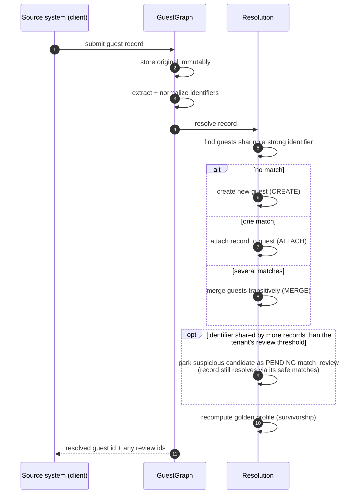

# Feature Specification: Core Identity Resolution Service

**Feature Branch**: `001-core-identity-resolution`

**Created**: 2026-07-09

**Status**: Draft

**Input**: User description: "Build the GuestGraph core identity resolution service per the approved design doc at docs/superpowers/specs/2026-07-09-guestgraph-core-design.md (slice 1 of the roadmap). Ingest raw guest records from registered per-tenant source systems via REST API, storing originals immutably; resolve identities deterministically on normalized strong identifiers with transitive merging; produce a derived golden Guest profile via survivorship rules; record every merge as a MergeEvent with matcher name + confidence; support explain and unmerge; route suspicious matches to a MatchReview queue; store malformed-but-parseable records flagged needs_review; lookup guests by normalized identifier; RFC 9457 errors; per-tenant API keys. Probabilistic-ready data model so slice 2 lands without migration."

## User Scenarios & Testing *(mandatory)*

### User Story 1 - Ingest Records and Resolve Identities (Priority: P1)

A hotel group's integration engineer registers each of their systems (property management system, loyalty program, wifi portal, ...) as a source system under their tenant, then sends guest records from those systems into GuestGraph. For every record ingested, the service stores the original exactly as received, determines whether the record belongs to a guest it already knows (by shared strong identifiers such as email, phone, loyalty ID, ID document, or an external key), and answers with the identity of the resolved guest. Records that share a strong identifier end up on the same guest — even indirectly (record A shares an email with B, B shares a phone with C: A, B, and C are one guest).

**Why this priority**: Ingestion plus resolution is the product. Without it nothing else — profiles, explain, review — has data to operate on. This story alone turns scattered records into deduplicated guests, which is the core value proposition.

**Independent Test**: Register a source system, ingest a set of records with overlapping identifiers, and verify the service reports the expected number of distinct guests and that each record is attached to the right one.

**Acceptance Scenarios**:

1. **Given** a registered source system and no existing guests, **When** a record with a new email is ingested, **Then** a new guest is created and the response identifies that guest.
2. **Given** an existing guest with email `anna@example.com`, **When** a record from a different source system with the same email (in different case/whitespace) is ingested, **Then** the record is attached to the existing guest, not a new one.
3. **Given** two existing distinct guests, **When** a record is ingested that shares one strong identifier with each of them, **Then** the two guests are merged into one, the record is attached to it, and the merge is recorded with the deciding matcher's name and its confidence.
4. **Given** a record whose payload can be parsed but whose contents are malformed (e.g. unusable email format, missing all identifiers), **When** it is ingested, **Then** the record is stored and flagged as needing review — it is never dropped.
5. **Given** a request that cannot be parsed at all, **When** it is submitted, **Then** it is rejected with a machine-readable problem-details error explaining exactly what was wrong, and nothing is stored.
6. **Given** records ingested concurrently that would merge the same guests, **When** ingestion completes, **Then** the resulting guest graph is consistent — no duplicated or half-merged guests.

**Resolution flow** (behavioral contract of this story):

---

### User Story 2 - Query Golden Profiles and Look Up Guests (Priority: P2)

A front-desk application or CRM queries GuestGraph for a guest's golden profile — the single best view of the person, derived from all their source records (most recent non-null value wins per field) — along with the guest's normalized identifiers and the underlying source records. It can also look a guest up directly by an identifier value ("who is +41 79 123 45 67?").

**Why this priority**: Resolution is only useful if consumers can read the result. This story makes the resolved graph consumable and delivers the first end-to-end business value: one trustworthy profile per guest.

**Independent Test**: After ingesting records for a known guest, fetch the guest's profile, its identifier list, and its source records; look the guest up by email and by phone and verify the same guest is returned.

**Acceptance Scenarios**:

1. **Given** a guest with three source records containing conflicting field values, **When** its golden profile is fetched, **Then** each profile field carries the most recent non-null value across those records.
2. **Given** a guest resolved from multiple systems, **When** its source records are fetched, **Then** every original record is returned exactly as it was received.
3. **Given** an identifier value in any equivalent form (mixed-case email, phone with spaces), **When** a lookup is performed, **Then** the guest holding the normalized form of that identifier is returned.
4. **Given** an identifier no guest holds, **When** a lookup is performed, **Then** an empty result is returned (not an error).
5. **Given** a guest ID belonging to tenant A, **When** tenant B requests it, **Then** the service responds as if the guest does not exist.

---

### User Story 3 - Explain and Reverse a Merge (Priority: P3)

A data steward at the hotel group notices a profile that looks wrong — two different people appear as one guest. They ask GuestGraph to explain why those records were merged and receive the full decision chain: which records or guests were merged, which matcher decided each step, with what confidence, and when. If a merge was wrong, they undo it: the offending link is removed and resolution is replayed, so the remaining records regroup correctly.

**Why this priority**: Wrong merges are privacy incidents. Explainability and reversibility are the safety machinery that makes automated identity resolution trustworthy enough to deploy — and they are prerequisites for the probabilistic matching planned next.

**Independent Test**: Ingest records that trigger a merge, request the explanation and verify the complete chain is returned; unmerge, then verify the guests are separate again and each record sits with the correct guest.

**Acceptance Scenarios**:

1. **Given** a guest formed by several merges, **When** an explanation is requested, **Then** the full chain of merge decisions is returned, each with the records/guests involved, the deciding matcher's name, its confidence, and the time of the decision.
2. **Given** a guest containing a wrongly attached record, **When** an unmerge for that link is requested, **Then** the link is removed, resolution is replayed over the affected records, and the resulting guests reflect only the remaining evidence.
3. **Given** a completed unmerge, **When** the same wrong record is ingested again unchanged, **Then** the system does not silently recreate the identical wrong merge without any trace — the unmerge and any subsequent decisions remain visible in the decision history.
4. **Given** any unmerge, **When** it completes, **Then** no source record has been altered or lost — only links between records and guests changed.

---

### User Story 4 - Review Uncertain Matches (Priority: P4)

Some matches are technically valid but suspicious — for example one email address shared by 40 records (a family, a travel agency, or a front-desk default address). Instead of merging automatically, GuestGraph parks such cases in a review queue. A data steward lists the pending reviews and confirms (the merge proceeds, recorded like any other) or rejects (the records stay separate) each one. How many records may share an identifier before a match counts as suspicious is configurable per tenant.

**Why this priority**: Protects profile quality against the classic shared-identifier failure mode, and establishes the human-in-the-loop channel that probabilistic matching (next roadmap slice) will rely on as its primary pathway.

**Independent Test**: Configure a low sharing threshold, ingest records that exceed it, verify no automatic merge happened and a review entry exists; confirm one review and reject another, verifying the respective outcomes.

**Acceptance Scenarios**:

1. **Given** a tenant threshold of N records per identifier, **When** an ingested record would link via an identifier already held by more than N records, **Then** no automatic merge occurs and a review entry is created describing the candidate match.
2. **Given** a pending review, **When** a steward confirms it, **Then** the merge is executed and recorded with matcher name and confidence like any automatic merge.
3. **Given** a pending review, **When** a steward rejects it, **Then** the records remain on separate guests and the rejection is recorded.
4. **Given** pending reviews in tenant A, **When** tenant B lists its review queue, **Then** tenant A's entries are not visible.

---

### Edge Cases

- Two guests both match an incoming record while one of the implied merges is suspicious: the safe portion may proceed, the suspicious link goes to review — no partial, inconsistent merge state.
- The same record (same source system and external key) is ingested twice: no duplicate source record or spurious second guest results.
- A record carries an identifier value that exists in another tenant: no cross-tenant match may ever occur.
- An unmerge is requested for a guest with only one source record: nothing to split — the request fails with a clear problem-details error.
- A confirm/reject is submitted for a review entry that was already decided: the second decision is rejected with a clear error; the first stands.
- A record contains several identifiers where one is malformed and others are valid: the record resolves on the valid identifiers and is flagged for review of the malformed portion — it is not dropped.
- The tenant's sharing threshold is changed: existing guests are unaffected; the new threshold applies to subsequent resolutions.

## Requirements *(mandatory)*

### Functional Requirements

**Tenancy & access**

- **FR-001**: Every piece of data and every operation MUST be scoped to a single tenant; no request may ever read or affect another tenant's data.
- **FR-002**: Every API request MUST be authenticated with a per-tenant API key; requests without a valid key are refused.

**Source systems & ingestion**

- **FR-003**: Users MUST be able to register named source systems under their tenant; every ingested record MUST reference a registered source system.
- **FR-004**: The service MUST accept guest records (singly or in batches) and store each original payload immutably — originals are never modified or deleted by any operation, and each record's outcome is reported individually.
- **FR-005**: The service MUST extract and normalize strong identifiers from ingested records — email (lowercased, trimmed), phone (canonical international form), loyalty ID, ID document (stored only as a hash, never in plaintext), and external key.
- **FR-006**: Records that are malformed but parseable MUST be stored and flagged `needs_review` rather than rejected; only unparseable requests are refused, with a machine-readable problem-details response (RFC 9457) stating the reason. No parseable data is ever dropped.

**Resolution**

- **FR-007**: On ingest, the service MUST resolve each record within the tenant by shared strong identifiers: no match creates a new guest; one match attaches the record; two or more matches merge those guests into one (transitive identity).
- **FR-008**: Resolution MUST complete within the ingest request, so the response identifies the resolved guest.
- **FR-009**: Every merge decision MUST be recorded as an auditable merge event carrying the records/guests involved, the deciding matcher's name, its confidence score (1.0 for deterministic decisions), and the decision time.
- **FR-010**: The resolution mechanism MUST be structured as candidate scoring (candidate matches in, scored decisions out) so future matching strategies can be added without changing the recorded data's shape — confidence scores, matcher metadata, and the review queue are part of the model from day one.
- **FR-011**: Concurrent ingestion MUST never corrupt the graph: simultaneous operations affecting the same guests within a tenant MUST yield the same end state as if applied one at a time.

**Golden profile & query**

- **FR-012**: The service MUST derive a golden profile per guest from its source records using survivorship rules (most recent non-null value wins per field); the profile is recomputable at any time from the unaltered originals.
- **FR-013**: Users MUST be able to fetch a guest's golden profile with its normalized identifiers, and the guest's underlying source records as originally received.
- **FR-014**: Users MUST be able to look up guests by an identifier value; the value is normalized before matching, and a miss returns an empty result, not an error.

**Explain & unmerge**

- **FR-015**: Users MUST be able to request, for any guest, the complete chain of merge events explaining why its records belong together.
- **FR-016**: Users MUST be able to unmerge a wrongly merged guest: the offending link is removed, resolution is replayed over the affected records, the outcome is recorded in the decision history, and no source record is altered or lost.

**Match review**

- **FR-017**: When an identifier is shared by more records than a per-tenant configurable threshold, the candidate match MUST be queued for review instead of automatically merged.
- **FR-018**: Users MUST be able to list pending reviews and confirm or reject each exactly once; confirmation executes and records the merge, rejection keeps the records separate and is itself recorded.

**Errors**

- **FR-019**: All error responses across the API MUST follow the machine-readable problem-details format (RFC 9457) and state what was wrong.

### Key Entities

- **Tenant**: An isolated customer space (hotel brand, property, or group); owns all other entities and the API keys and configuration (e.g. review threshold) that govern them.
- **Source System**: A named external origin of guest data registered under a tenant (e.g. "opera-pms", "loyalty-db").
- **Source Record**: One guest record as received from a source system — the immutable original payload plus the normalized fields and identifiers extracted from it; may carry a `needs_review` flag.
- **Guest**: The resolved person — the golden profile derived from its linked source records via survivorship rules.
- **Identifier**: A normalized strong identifier held by a guest — email, phone, loyalty ID, hashed ID document, or external key.
- **Resolution Link**: The association between a source record and the guest it currently belongs to; the thing an unmerge removes.
- **Merge Event**: The audit record of one merge decision — which records/guests merged, deciding matcher, confidence, when; the basis for explain and unmerge.
- **Match Review**: A queued uncertain or suspicious candidate match awaiting a human confirm/reject decision, with its resolution recorded.

## Success Criteria *(mandatory)*

### Measurable Outcomes

- **SC-001**: For a reference corpus of ingest scenarios (shared identifiers across systems, transitive chains, shared family emails, unmerge-then-reingest), the service produces the expected guest grouping in 100% of cases.
- **SC-002**: A single-record ingest returns the resolved guest identity in the same interaction, in under 1 second under normal load.
- **SC-003**: 100% of merged guests can produce a complete explanation chain in which every step carries a matcher name, a confidence score, and a timestamp.
- **SC-004**: 100% of merges are reversible: after an unmerge, wrongly linked records no longer share a guest, and every original record remains retrievable bit-for-bit as received.
- **SC-005**: Zero parseable records are lost at ingest: every parseable submission is retrievable afterwards, either resolved or flagged for review.
- **SC-006**: Zero cross-tenant results: no operation ever returns or modifies data belonging to another tenant.
- **SC-007**: 100% of candidate matches exceeding the tenant's identifier-sharing threshold appear in the review queue instead of auto-merging.
- **SC-008**: A steward can go from "this profile looks wrong" to a completed, verified unmerge using only the service's own responses (explanation plus unmerge), with no manual data repair.

## Assumptions

- Tenants and their API keys are provisioned through operator/administrative configuration; self-service tenant sign-up and key rotation are not part of this feature.
- One golden profile represents one person within one tenant; the same real-world person appearing in two tenants is intentionally two unrelated guests.
- Corrections to guest data arrive as new records from source systems; there is no direct profile-editing capability.
- Batch ingestion is an efficiency convenience: each record in a batch is resolved independently and reported individually.
- "Most recent" in survivorship is determined per record from the best available timestamp (a source-provided timestamp if present, otherwise time of receipt).
- The per-tenant review threshold has a sensible default so the review queue works without initial configuration.
- Duplicate detection at ingest relies on the source system plus its external record key, where the key identifies one *observation* (version) of a source object, not the object itself. Sources that resend the identical version produce one stored original; sources whose objects mutate over their lifecycle (e.g. guest data edited on a PMS reservation, or persons embedded entity-less in a booking without their own id) submit each version as a new record with a version-qualified key — the immutable records then form the object's history, and survivorship surfaces the latest values in the golden profile.
- Privacy-regulation tooling (per-guest erasure and export) is a known future obligation; this feature must not preclude it but does not deliver it.
